[aryan.climorisk.com](https://aryan.climorisk.com/) &nbsp;·&nbsp;
[linkedin](https://www.linkedin.com/in/aryanrajputiitm/) &nbsp;·&nbsp;
[x](https://x.com/aryanrajputiitm) &nbsp;·&nbsp;
[instagram](https://www.instagram.com/yash_aryanrajput/) &nbsp;·&nbsp;
[email](mailto:aryanrajput48034@gmail.com)

> Engineering Student at IIT Madras, building climate intelligence platforms, 
> web products, and scalable tech for organizations.

Founder &amp; CTO at [CLIMORISK](https://www.climorisk.com) — climate intelligence for organizations. 
I care about shipping real products: clear UX, solid backends, and systems that scale.

<samp>python &nbsp; typescript &nbsp; javascript &nbsp; react &nbsp; node &nbsp; django &nbsp; nestjs &nbsp; postgres &nbsp; mongodb &nbsp; aws &nbsp; git</samp>

**[climorisk.com](https://www.climorisk.com)** &nbsp;·&nbsp; <samp>climate intelligence</samp> 
Climate risk and intelligence platform for organizations — product, 
engineering, and systems at [aryan.climorisk.com](https://aryan.climorisk.com/).

